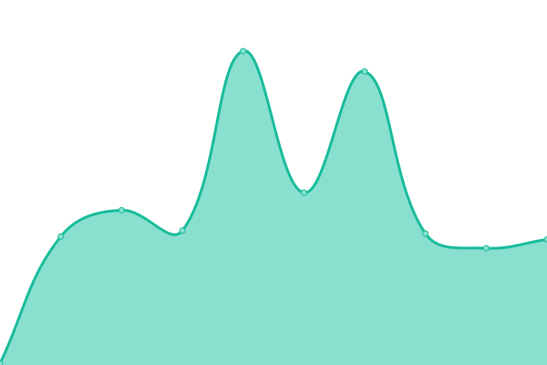

# [📈 Live Status](https://demo.upptime.js.org): <!--live status--> **🟧 Partial outage**

This repository contains the open-source uptime monitor and status page for [Upptime](https://upptime.js.org), powered by [Upptime](https://github.com/upptime/upptime).

With [Upptime](https://upptime.js.org), you can get your own unlimited and free uptime monitor and status page, powered entirely by a GitHub repository. We use [Issues](https://github.com/upptime/upptime/issues) as incident reports, [Actions](https://github.com/upptime/upptime/actions) as uptime monitors, and [Pages](https://demo.upptime.js.org) for the status page.

<!--start: status pages-->
<!-- This summary is generated by Upptime (https://github.com/upptime/upptime) -->
<!-- Do not edit this manually, your changes will be overwritten -->
<!-- prettier-ignore -->
| URL | Status | History | Response Time | Uptime |
| --- | ------ | ------- | ------------- | ------ |
|  [My Web Site](https://go-boat.f5.si) | 🟩 Up | [my-web-site.yml](https://github.com/Hikaru2070/system-uptime-monitor/commits/HEAD/history/my-web-site.yml) | 

 249ms
     
 | 

<a href="https://upptime.github.io/upptime/history/my-web-site">100.00%</a>
    

|  [SCP-JP Wiki](https://scp-jp.wikidot.com) | 🟩 Up | [scp-jp-wiki.yml](https://github.com/Hikaru2070/system-uptime-monitor/commits/HEAD/history/scp-jp-wiki.yml) | 

 297ms
     
 | 

<a href="https://upptime.github.io/upptime/history/scp-jp-wiki">100.00%</a>
    

|  [Limbus Company Login](http://limbuscompanyapi.com/login) | 🟥 Down | [limbus-company-login.yml](https://github.com/Hikaru2070/system-uptime-monitor/commits/HEAD/history/limbus-company-login.yml) | 

 0ms
     
 | 

<a href="https://upptime.github.io/upptime/history/limbus-company-login">0.00%</a>
    

|  [Google](https://google.com) | 🟩 Up | [google.yml](https://github.com/Hikaru2070/system-uptime-monitor/commits/HEAD/history/google.yml) | 

 166ms
     
 | 

<a href="https://upptime.github.io/upptime/history/google">100.00%</a>
    

|  [IPv6 test](forwardemail.net) | 🟥 Down | [i-pv6-test.yml](https://github.com/Hikaru2070/system-uptime-monitor/commits/HEAD/history/i-pv6-test.yml) | 

 0ms
     
 | 

<a href="https://upptime.github.io/upptime/history/i-pv6-test">100.00%</a>
    

<!--end: status pages-->

[**Visit our status website →**](https://demo.upptime.js.org)

## 📄 License

- Powered by: [Upptime](https://github.com/upptime/upptime)
- Code: [MIT](./LICENSE) © [Anand Chowdhary](https://anandchowdhary.com), supported by [Pabio](https://pabio.com)
- Data in the `./history` directory: [Open Database License](https://opendatacommons.org/licenses/odbl/1-0/)
